# Retail Sales & Business Intelligence Dashboard

An end-to-end **Retail Analytics and Business Intelligence solution developed in Microsoft Power BI**, designed to provide a comprehensive view of sales performance, profitability, products, stores, customers, regions, and returns.

The project transforms retail data into actionable business insights through **data modeling, DAX measures, KPI development, time-based analysis, interactive filtering, and data visualization**.

---

## Project Overview

This Power BI solution analyzes retail business performance from multiple perspectives, combining financial, operational, product, customer, regional, and returns analysis into an interactive dashboard.

The report is structured around four main analytical areas:

- **Executive Overview** — High-level financial and operational performance.
- **Sales & Products Analysis** — Sales volume, product, brand, and store performance.
- **Customer & Regional Insights** — Customer characteristics, geographic distribution, and customer value.
- **Return Analysis** — Return activity, return value, return rates, and performance across stores, regions, and brands.

The dashboard is designed to support both **high-level performance monitoring and detailed exploratory analysis**.

---

## Dashboard Preview

The dashboard is available in both **Dark Mode** and **Light Mode**, providing alternative visual themes while maintaining consistent analytical functionality and visual hierarchy.

### Executive Overview

#### Dark Mode

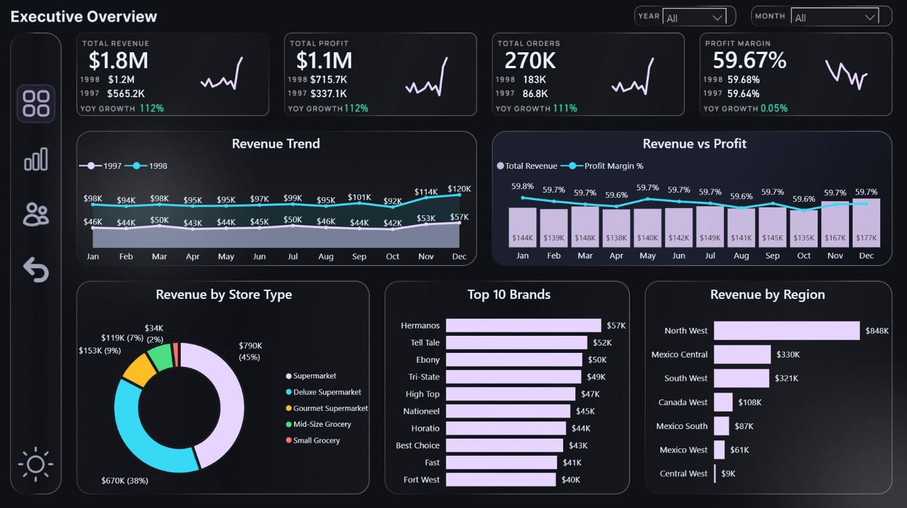

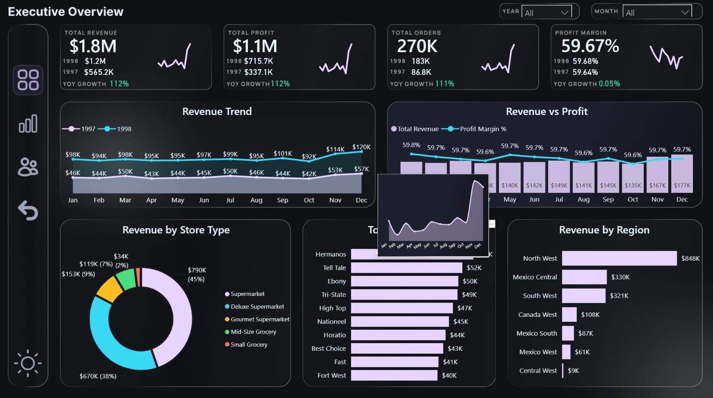

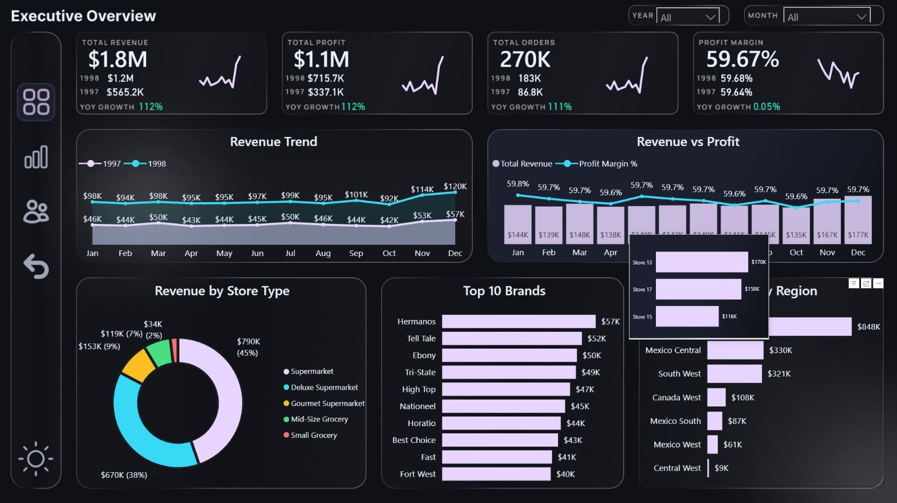

#### Light Mode

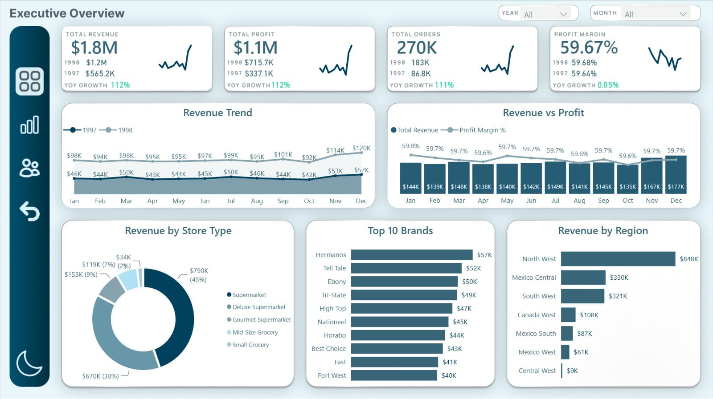

---

### Sales & Products Analysis

#### Dark Mode

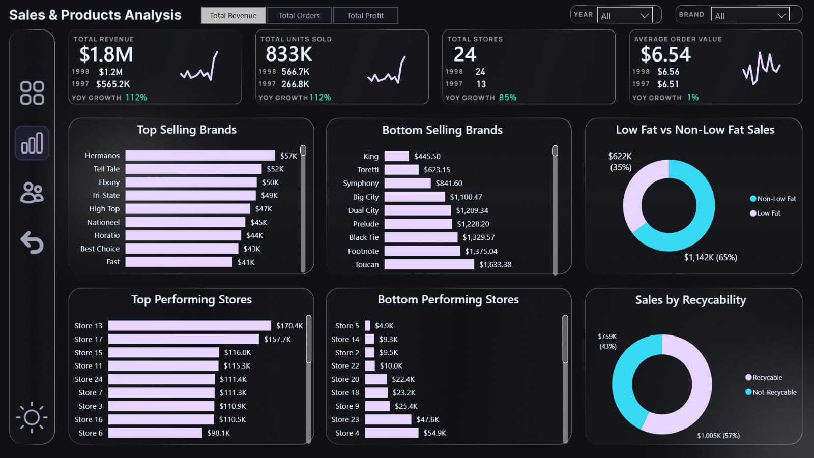

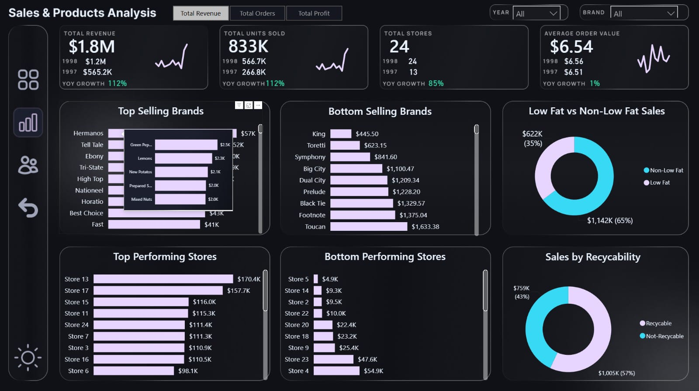

#### Light Mode

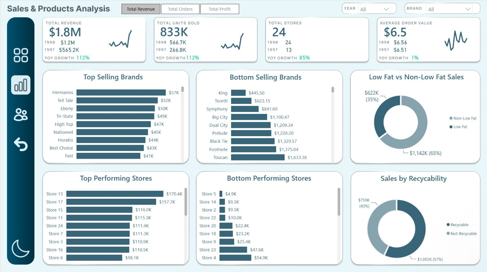

---

### Customer & Regional Insights

#### Dark Mode

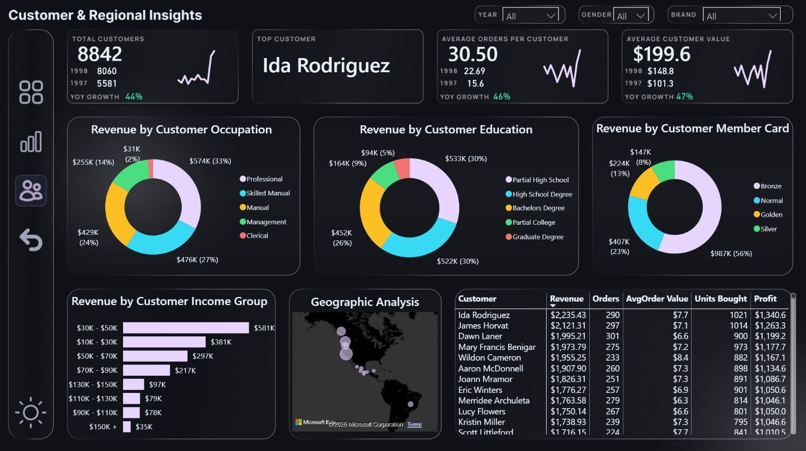

#### Light Mode

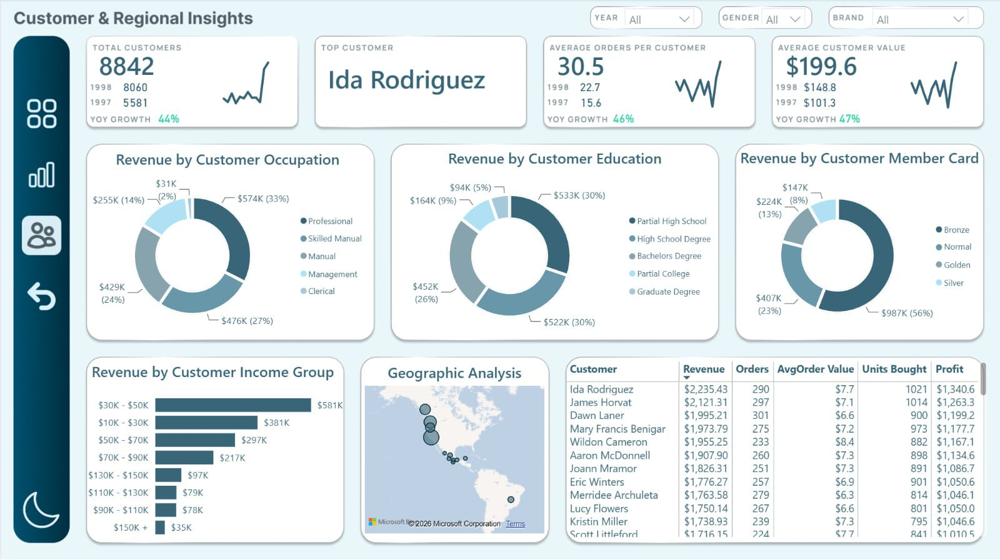

---

### Return Analysis

#### Dark Mode

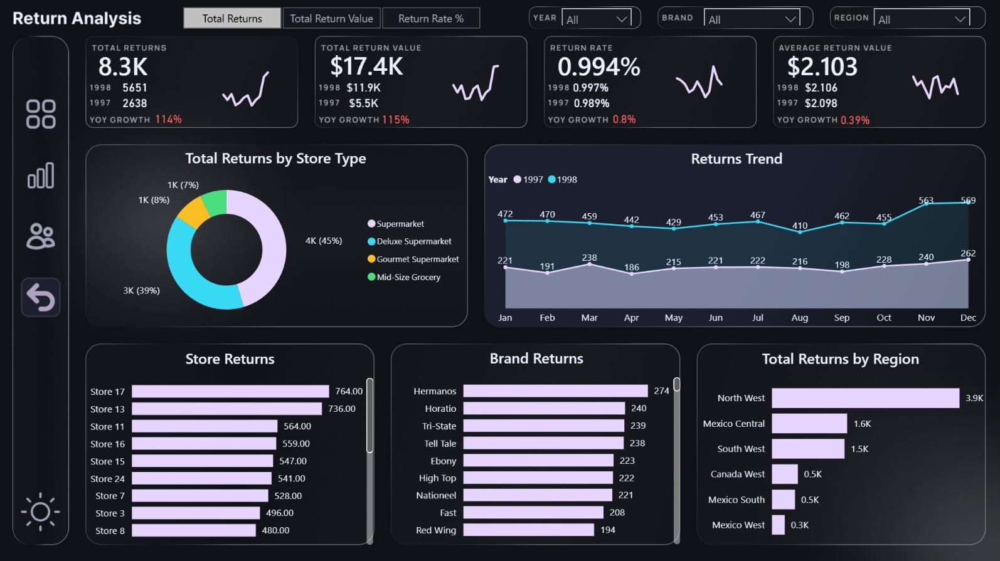

#### Light Mode

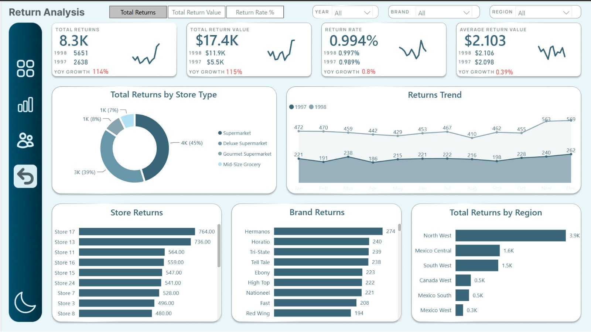

---

## Key Analytical Areas

### Executive Performance

The Executive Overview provides a consolidated view of overall business performance, including:

- Total Revenue
- Total Orders
- Total Profit
- Profit Margin
- Revenue trends
- Regional performance
- Brand performance
- Store-type performance
- Revenue versus profit analysis
- Year-over-year performance comparisons

---

### Sales & Product Analytics

The Sales & Products Analysis dashboard focuses on identifying the products, brands, and stores driving business performance.

Analysis includes:

- Total Units Sold
- Average Order Value (AOV)
- Product and brand performance
- Top and lower-performing brands
- Store-level performance
- Sales trends
- Product characteristics
- Low-fat product analysis
- Product recyclability
- Year-over-year growth

---

### Customer & Regional Analytics

The Customer & Regional Insights dashboard provides a customer-centric view of the business.

Analysis includes:

- Customer distribution by geography
- Customer revenue contribution
- Customer income
- Membership status
- Occupation
- Education
- Gender distribution
- Top customers
- Revenue per customer
- Orders per customer
- Customer growth
- Customer value analysis

---

### Return Analysis

The Return Analysis dashboard evaluates product returns and their potential impact on business performance.

Analysis includes:

- Total Returns
- Total Return Value
- Return Rate
- Average Return Value
- Returns by store
- Returns by region
- Returns by store type
- Returns by brand
- Return trends over time
- Year-over-year return analysis

---

## Key Performance Indicators

The Power BI model includes a dedicated set of DAX measures for calculating core business KPIs and performance indicators.

### Sales & Financial KPIs

- **Total Revenue**
- **Total Orders**
- **Total Profit**
- **Profit Margin %**
- **Total Units Sold**
- **Average Order Value**

### Customer KPIs

- **Total Customers**
- **Average Orders per Customer**
- **Average Revenue per Customer**
- **Top Customer**

### Returns KPIs

- **Total Returns**
- **Total Return Value**
- **Return Rate %**
- **Average Return Value**

### Growth & Time Intelligence

Year-over-year calculations are used to evaluate changes in key business metrics, including:

- Revenue YoY Growth
- Profit YoY Growth
- Orders YoY Growth
- Profit Margin YoY Growth
- Units Sold YoY Growth
- Average Order Value YoY Growth
- Store YoY Growth
- Customer YoY Growth
- Customer Value YoY Growth
- Returns YoY Growth
- Return Value YoY Growth
- Return Rate YoY Growth
- Average Return Value YoY Growth

---

## Data Model

The report uses a structured Power BI analytical model with dedicated dimensions for the main business entities.

### Dimension Tables

- `dim_calendar`
- `dim_customers`
- `dim_products`
- `dim_region`
- `dim_stores`

### Analytical / Transaction Tables

- `vw_all_sales`
- `vw_returns_detail`

### DAX

- `Dax_Measures`

This structure supports consistent filtering, time-based analysis, and reusable calculations across the report.

---

## Interactive Dashboard Features

The report incorporates interactive functionality to allow users to explore the data from different business perspectives.

### Features include:

- Interactive slicers
- Year and date filtering
- Region filtering
- Product and brand filtering
- Store analysis
- Customer segmentation
- Dynamic metric selection
- KPI cards
- Comparative analysis
- Interactive charts and tables
- Tooltip pages
- Year-over-year analysis
- Dark and Light report themes

---

## Technical Implementation

### Power BI

- Dashboard development
- Data modeling
- Interactive visualizations
- KPI cards
- Slicers and filters
- Tooltip pages
- Report navigation
- Theme development

### DAX

- Measure development
- KPI calculations
- Aggregation
- Time intelligence
- Year-over-year calculations
- Profitability metrics
- Customer metrics
- Store performance metrics
- Return-rate calculations

### Data Modeling

- Dimension-based analytical structure
- Relationships between business entities
- Calendar-based analysis
- Reusable DAX measures
- Multi-dimensional business analysis

---

## Business Questions Addressed

The dashboard enables analysis of questions such as:

- How is the retail business performing overall?
- Which stores and regions generate the strongest revenue and profit?
- Which brands and products are driving sales?
- How is sales performance changing over time?
- What is the average value of an order?
- Who are the highest-value customers?
- How does customer performance vary across different segments?
- Which regions and stores have the highest return activity?
- What is the financial impact of product returns?
- How are key business KPIs changing year over year?

---

## Project Structure

```text
Retail Sales & Business Intelligence Dashboard
│
├── Grad Project.pbix
│
├── assets/
│   ├── .gitkeep
│   │
│   ├── customer-regional-insights-dark.jpeg
│   ├── customer-regional-insights-light.jpeg
│   │
│   ├── executive-overview-1-dark.jpeg
│   ├── executive-overview-2-dark.jpeg
│   ├── executive-overview-3-dark.jpeg
│   ├── executive-overview-light.jpeg
│   │
│   ├── return-analysis-dark.jpeg
│   ├── return-analysis-light.jpeg
│   │
│   ├── sales-products-analysis-1-dark.jpeg
│   ├── sales-products-analysis-2-dark.jpeg
│   └── sales-products-analysis-light.jpeg
│
└── README.md
